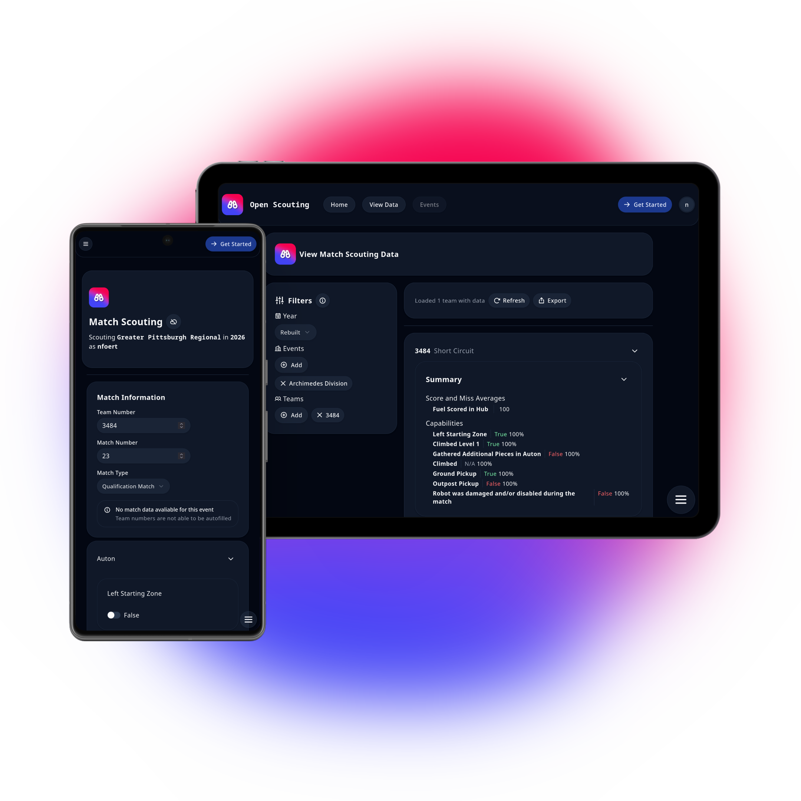

  <ul style="list-style: none; padding-left: 0px;">
    

      <h1>Open Scouting</h1>
    

  </ul>

**An open source application for easier scouting at FIRST Robotics competitions**

**[Live Server](https://open-scouting-dev.nfoert.dev/) • [Releases](https://github.com/FRC-Team3484/open-scouting/releases) • [Issues](https://github.com/FRC-Team3484/open-scouting/issues) • [Discord](https://discord.gg/M3wESZUP35)**

---

## Features
- Works on any relatively modern device, without needing scouting specific devices
- Full offline support
- Uses The Blue Alliance to automate parts of the scouting process
- Quick, UI based scouting field editing, allowing instant season setup
- Anyone can view and contribute data
- Support for custom events if they're missing on The Blue Alliance
- Collaborative pit scouting
- Match data view with summaries and charts
- Create an account for settings syncing
- Admin panel for server management
- Quick links to scouting at events

## Installation
- Follow the steps in [Development Installation](/docs/development-installation.md) for how to get Open Scouting up and running locally for development or contributing
- Follow the steps in [Production Installation](/docs/production-installation.md) for how to get Open Scouting installed on a server for production use

## Contributing
Contributions are welcome to this project! Please see the [issues](https://github.com/FRC-Team3484/open-scouting/issues) page or the [roadmap](/docs/ROADMAP.md) for any current bugs or features that need implemented. Features in the roadmap should be prioritized over features as an issue, although any help is always appreciated.

Additionally, there's a document explaining how to use several systems provided in the client that may be needed while adding new features [here](/docs/client-systems.md)

When contributing, please fork this repository (ensure you uncheck the "Copy the `main` branch only" check box, this gives you access to any of the upcoming version branches with the latest changes.)

Next, create a new branch and implement your changes. You can install this project locally for testing by following the steps in [Development Installation](#development-installation). Once you've made your changes, please open a pull request into the next version branch, and your changes will be reviewed and merged

Eventually, that version branch will be merged into `main` and your changes will be released into production with a new release. Thanks for your contribution!

## To-Do
Please see the [roadmap](/docs/ROADMAP.md) for the currently planned out things that need to be completed. Additionally, see the [issues page](https://github.com/FRC-Team3484/open-scouting/issues) for any current bugs or features that need implemented, but aren't officially scheduled.