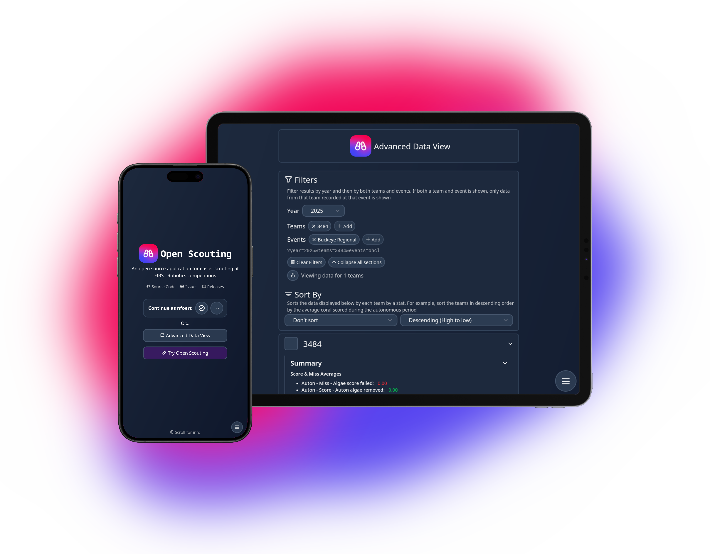

  

  <h1>Open Scouting</h1>

  **An open source application for easier scouting at FIRST Robotics competitions**

  **[Live Server](https://206.189.255.232/) ● [Releases](https://github.com/FRC-Team3484/open-scouting/releases) ● [Issues](https://github.com/FRC-Team3484/open-scouting/issues) ● [Development branch](https://github.com/FRC-Team3484/open-scouting/tree/development)**

  

  

## Features
- Works on any device with a relatively modern web browser. No scouting specific tablets or computers are required, scouts can simply use their own phones
- Remains functional completely offline, in case of poor or non-existent connection in the stands
- Uses The Blue Alliance's API to grab match data allowing to quickly autofill team and match numbers when scouts specify what robot they're watching
- One JSON file needs edited in order to set up the app for a new season, so no season-specific data is hardcoded. This allows Open Scouting to be functional for a new season almost immediate
- Allow other teams to view and contribute data to the same server
- Create custom events if events aren't listed on TBA
- Keep backups of scouting reports locally, and keep track of used local storage
- Supports collaborative pit scouting from multiple scouts or other teams
- View match data in an advanced data view that supports team summaries, charts, and sorting and filtering the data by team and by score values
- Scouts can create an account to be able to favorite events and verify their scouting reports, but accounts are optional

## Installation
- Follow the steps in [Development Installation](./docs/Development_Installation.md) for how to get Open Scouting up and running locally for development or contributing
- Follow the steps in [Production Installation](./docs/Production_Installation.md) for how to get Open Scouting installed on a server for production use

## Contributing
Contributions are welcome to this project! Please see the [issues](https://github.com/FRC-Team3484/open-scouting/issues) page or the [roadmap](/docs/ROADMAP.md) for any current bugs or features that need implemented. Features in the roadmap should be prioritized over features as an issue, although any help is always appreciated.

You can view the guide on how `season_fields.py` is formatted [here](/docs/Formatting_Season_Fields.md) if your contribution involves this file

Additionally, there's a document explaining how to use several systems provided in the client that may be needed while adding new features [here](/docs/Client_Systems.md)

When contributing, please fork this repository (ensure you uncheck the "Copy the `main` branch only" check box, this gives you access to the `development` branch with the latest changes)

Next, create a new branch and implement your changes. You can install this project locally for testing by following the steps in [Development Installation](#development-installation). Once you've made your changes, please open a pull request into the `development` branch, and your changes will be reviewed and merged

Eventually, `development` will be merged into `main` and your changes will be released into production with a new release. Thanks for your contribution!

## To-Do
Please see the [roadmap](/docs/ROADMAP.md) for the currently planned out things that need to be completed. Additionally, see the [issues page](https://github.com/FRC-Team3484/open-scouting/issues) for any current bugs or features that need implemented, but aren't officially scheduled.